# OE39-FE-PR1-Binh

## DEMO

This project have 14 Demos responsive on PC, Tablet, Mobile. Please follow information below:

### DEMO On PC

#### Home Page

#### Product Detail Page

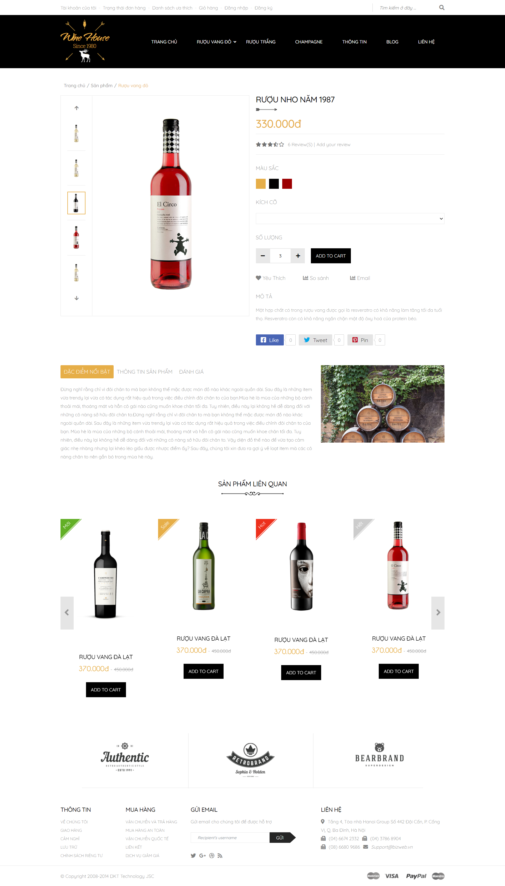

#### Product List Page

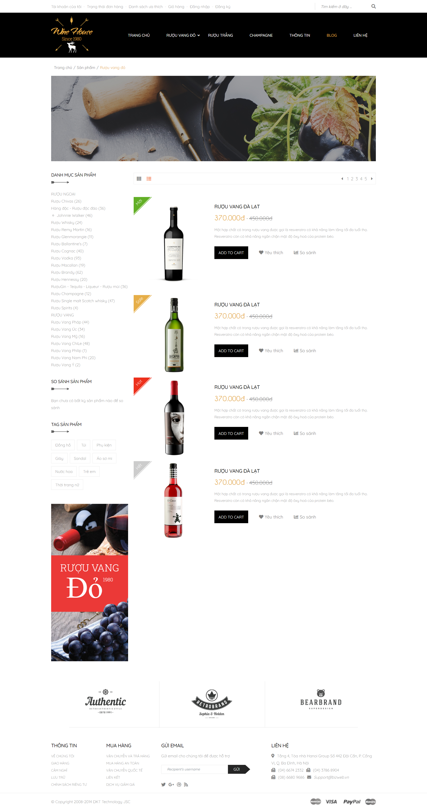

#### Product List Grid Page

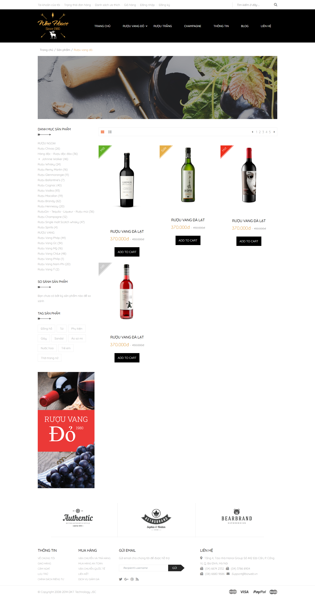

#### Cart Page

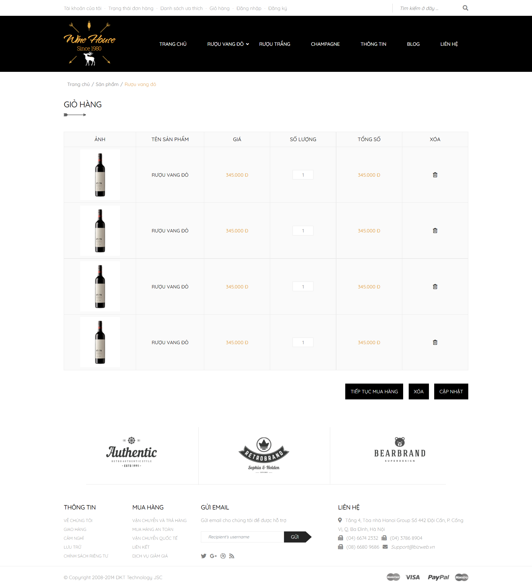

#### Invoice Page

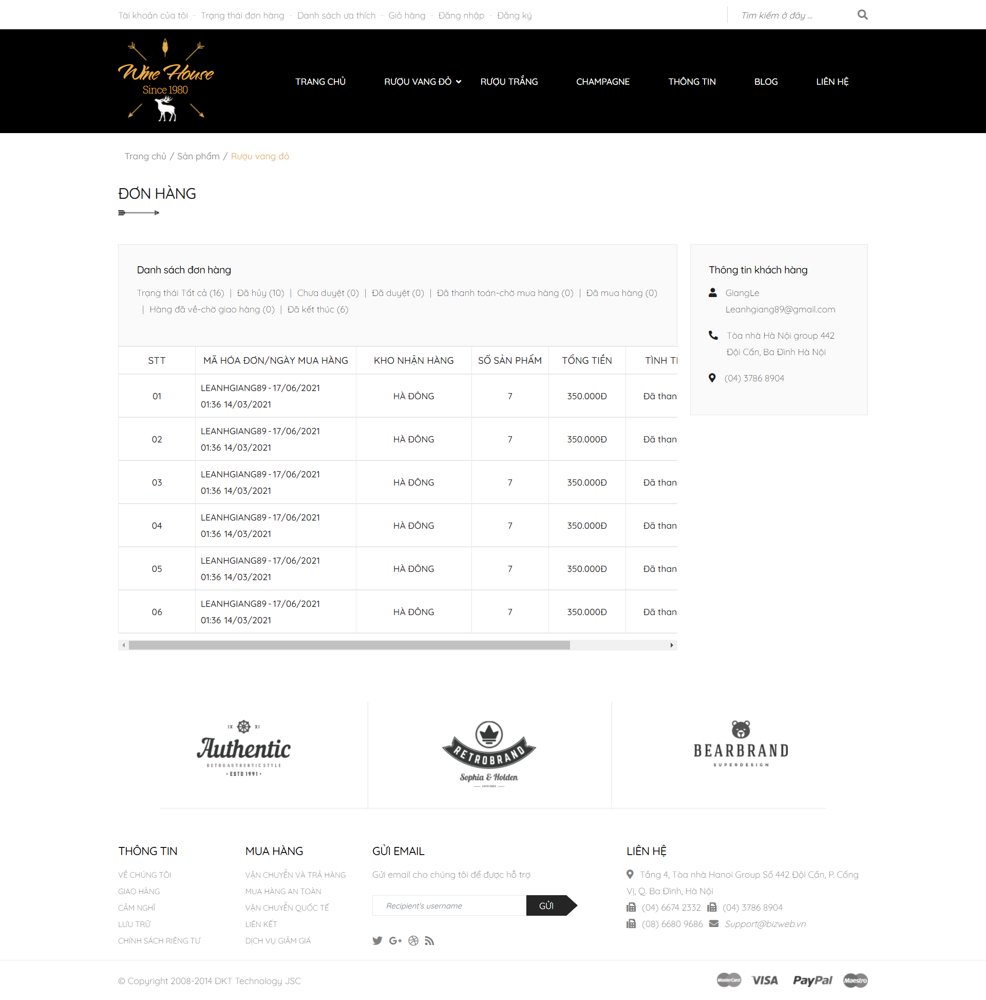

#### Account Customer Page

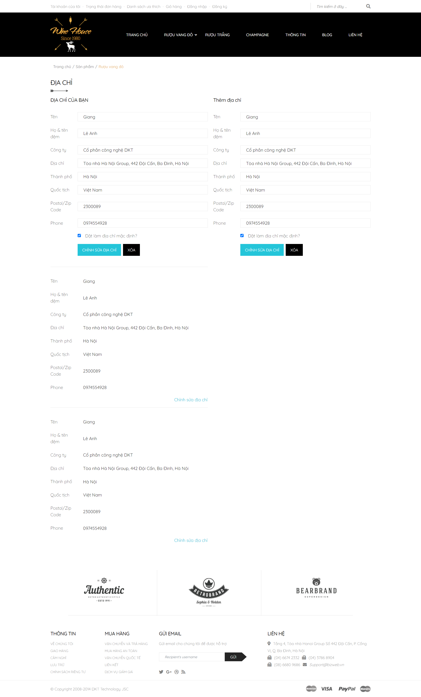

#### Blog Page

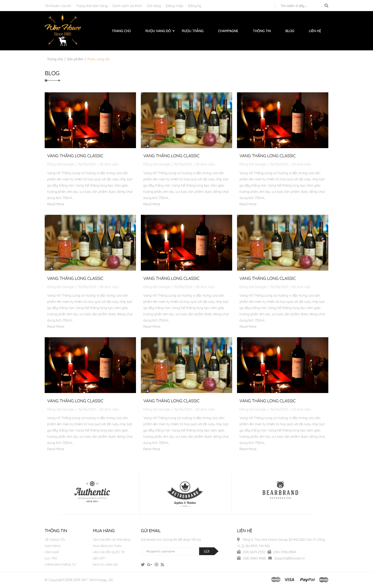

#### Post Detail Page

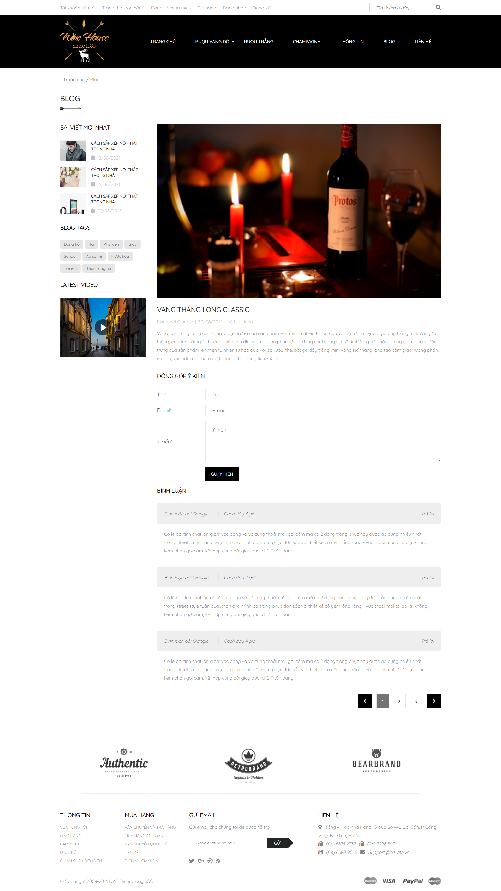

#### Signin Page

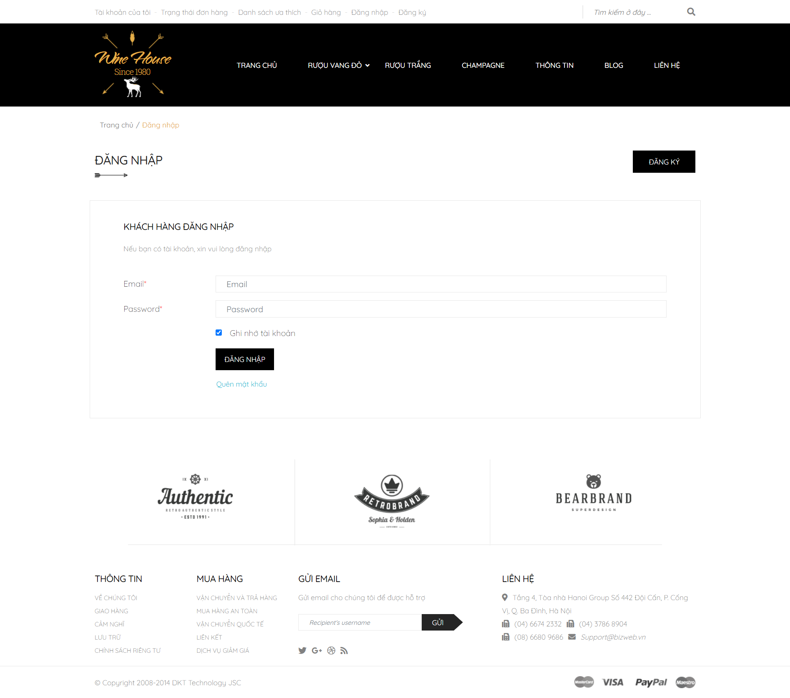

#### Signup Page

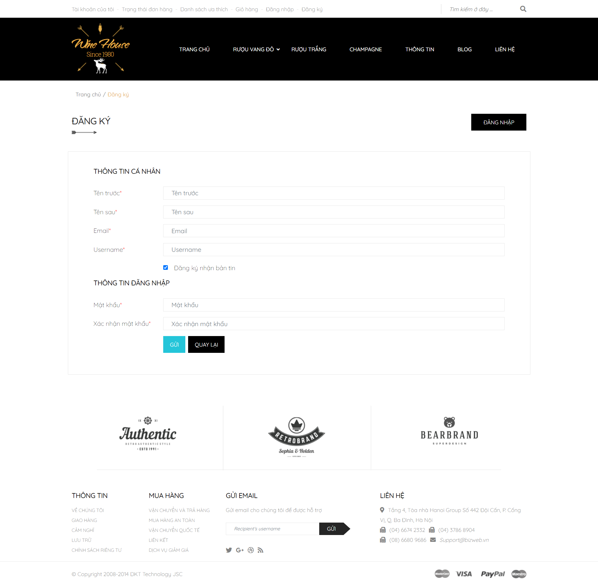

#### 404 Page

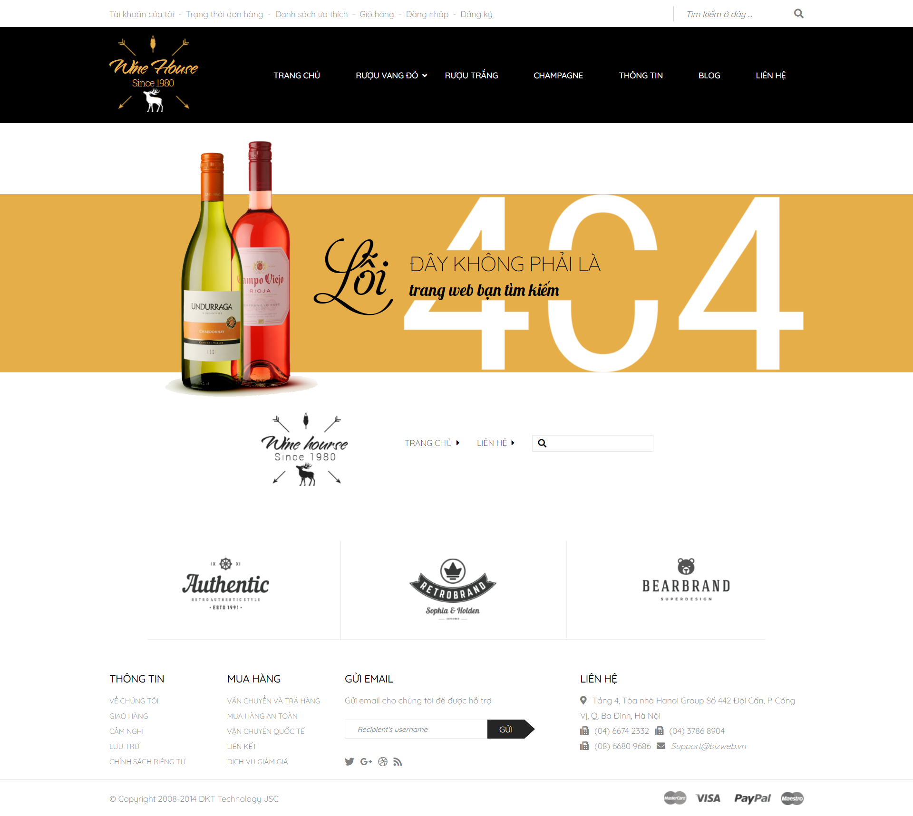

#### Introduce Page

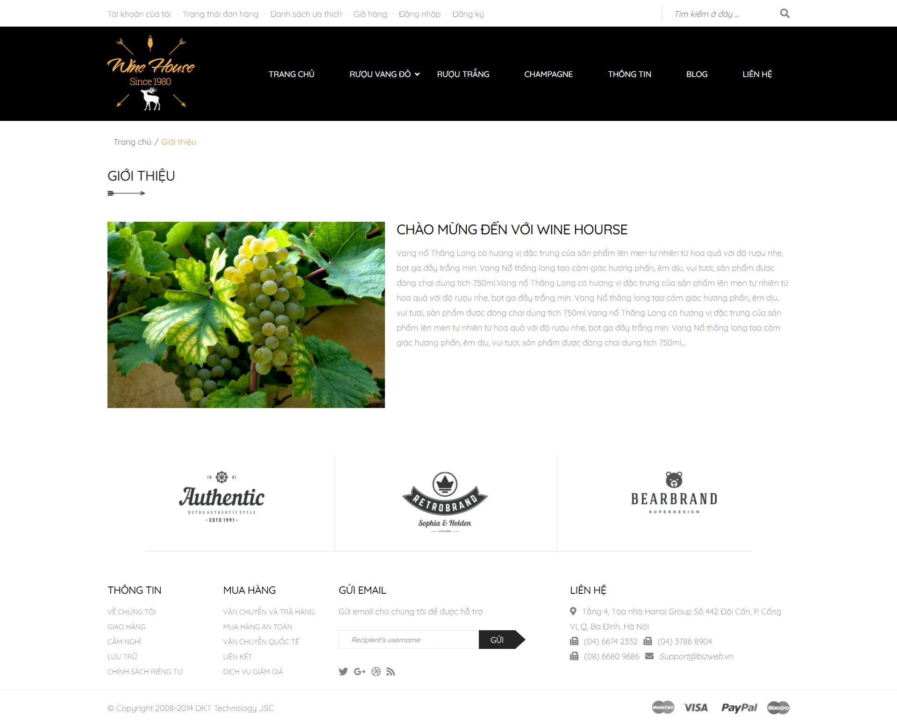

#### Contact Page

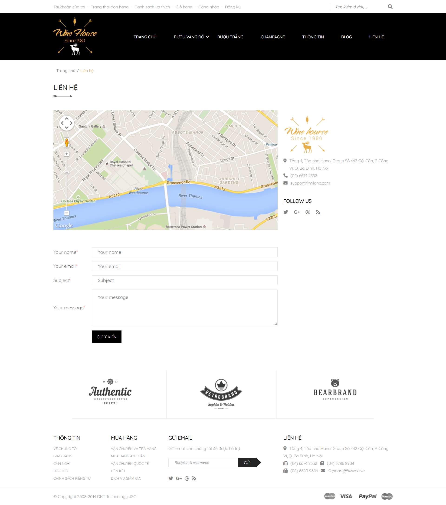

### DEMO On Tablet and Mobile

Please clone source code to your PC. Then run with Live Server on Visual Studio Code

## Usage

### Install Dependencies

<pre>npm install</pre>

### Run

<pre>npm run dev</pre>
